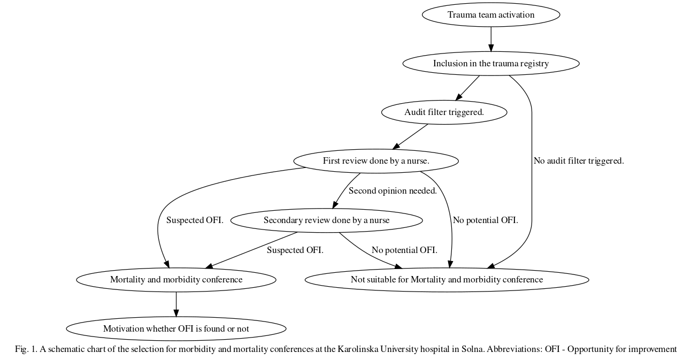

```{r main, include = FALSE, echo = FALSE, cache = FALSE}
#### Viktigt att ha med include = FALSE i chunks som inte ska skrivas ut i sin helhet.
source("main.R") 
```

```{r frequency.of.ofi, include = FALSE, echo = FALSE}
source("excluded.patients.R")
source("ofi.selection.R")
source("frequency.of.ofi.R")
source("df.freq.R")
source("bootcalculations.R")
source("deltatable.R")
source("delta.gender.table.R")
source("deltaminmajtable.R")
source("deltainjdomtable.R")
```
Abbreviations
=====
•	AIS - The Abbreviated Injury Scale
•	ISS - The Injury Severity Score
•	LMIC - Low and middle income countries
•	M&M - Morbidity and Mortality Conferences
•	NISS - The New Injury Severity Score
•	OFI - Opportunity for improvement
•	SweTrau - The Swedish trauma registry

Introduction: Trauma represents 9% of the annual global deaths and is the most common cause of death in people <45 years. It is a heterogeneous group of patients with a large variety of injuries. With this variety comes a complexity that demands specific guidelines for treating all kinds of different trauma subgroups. It is however poorly understood how the potential for trauma care improvement varies between these subgroups. One measure for this is Opportunity for improvement (OFI). Aims: In this study we assessed the OFI frequency for the clinically important trauma subgroups; men and women, blunt and penetrating trauma, minor and major trauma, and most severely injured body region. Material and methods: This was a registry based cohort study using the trauma registry and the trauma quality database at the Karolinska University hospital in Solna. 6146 patients added to the registries between 20xx-2021 met the inclusion criteria. 5718 patients were excluded due to either age <15 years or because of missing necessary information. Results: The mean OFI in the total cohort was 7%. It was found that Abdominal trauma had the highest frequency ofi OFI of all subgroups at 12,73% (CI:`r ci.abdomen`). In the binary subgroups blunt trauma at 7,08% and major trauma at 12,2% (CI: `r ci.major.trauma`) had the highest OFI. Conclusion: Our results suggest that OFI varies between trauma subgroups and that some subgroups have significantly higher OFI than baseline. Further research is however needed to find what kind of OFIs that are more frequent in different cohorts as well as OFI risk factors besides the actual trauma.

Keywords: Trama subgroups, Opportunity for improvement, Abdominal trauma, OFI

Background
=====

Trauma is defined as the clinical entity composed of physical injury and the body's associated response, as trauma represents about 9 % of annual global death it is one of the leading causes of mortality and morbidity in the world.[@Gerdin,@GBD_2017_Causes_of_Death_Collaborators2018-oe] Among people under the age of 45 trauma is the most common cause of death. Over the last decade
almost 50 million people worldwide have died from trauma [@GBD_2017_Causes_of_Death_Collaborators2018-oe].

Not only does trauma represent a large share of the global mortality rate, but studies 
have also shown a significant difference in outcome depending on where patients are
treated. It has for example been shown that trauma patients in Sweden who were treated at a trauma center rather than a non-trauma center had a 41 % lower 30-day adjusted mortality rate [@Candefjord2022-pe]. 

Some studies indicate that the number of trauma-related deaths that potentially could have been prevented are as high as 20 to over 50 %, while for example the rate of preventable deaths at the Karolinska University hospital trauma center was shown in a study to be 4.0 % [@Drake2020-kx; @Ray2016-jo; @Ghorbani2018-dh].  Preventable deaths varies not only between trauma centers and non-trauma centers. There is a significant difference between high income counties and low and middle income countries (LMICs). It is estimated that 2 million lives could be saved annually if LMICs and high income countries had equal fatality numbers for severe injuries [@Mock2012-lx].   


Trauma quality improvement
------------
Health care quality has been a topic for research for over 100 years. However, in the early research the focus were mainly on standards of performance connected to the skill levels of individual physicians. Meaning that when faults were made, answers were sought for in individuals rather than in the systems.[@Mock2009] 

In the 1980s focus shifted and terms like Trauma Quality Management and Continuous Quality Improvement were introduced. These programs lead to a more management focused approach and was involving all individuals in the work for improved health care quality. This shift also meant a more continuous evaluation of the health care, leading to the possibility for quality defects to be addressed more efficiently.[@Mock2009]

Since the early 2000s a term called Quality Improvement is used. Quality Improvement has a more multidisciplinary focused approach with Morbidity and Mortality conferences as an essential part. Quality improvement also further emphasizes the role of systems rather than clinical performances, as systems are more comparable to outcomes.[@Mock2009]

In the past decades several trauma quality improvement programs have been created. One of the more established ones is the Trauma Quality Improvement Program (TQIP) by the American College of Surgeons that was launched in 2008 [@Hemmila2010-sr]. The TQIP provides site-specific data of how well each hospital is preforming in terms of trauma care. This makes it possible to compare data with same level hospitals as well as evaluating how well each hospital is preforming, leading to changes in routines and practice guidelines [@Blackmore2019-bj].

Morbidity and Mortality Conferences
------------
An important part of trauma care evaluation and improvement is Mortality and Morbidity Conferences (M&M). This is a multidisciplinary conference with representatives from all medical specialties and professions in the trauma team. The purpose of M&M is to learn from the care provided, identify opportunities for improvements, and implement corrective actions[@Aboumatar2007-ws]. As it is not possible to analyze every trauma case in detail audit filters are often used to decide which cases that are to be reviewed at M&M [@Evans2009-oy].

Audit filters can be described as predefined statements that decides whether or not a certain event differ from the guidelines [@Berg2022]. Such audit filter can be time frames in which a test should be taken or a Glascow Coma Scale score under 8 without the patient being indubated[@Evans2009-oy]. 

Trauma Severity Scores
------------
 
The Abbreviated Injury Scale (AIS) defines traumatic injuries across 9 different body regions. The scale ranges from 1-5, where 1 is the least serious and 5 the most serious [@Kuo2017-dj].

The Injury Severity Score (ISS) is an anatomic severity scale developed to assess multiple-injured patients. The ISS score a patient gets is based on the AIS points from the injured body regions. The higher ISS score the more serious injury the patients suffers from. The ISS does however only take into account the most severe injury in each region, meaning that you could have two different injuries in the abdomen without it affecting the ISS score.[@Javali2019-wn]

The New Injury Severity Score (NISS) is developed from the ISS. NISS also takes injuries from the same body regions as NISS into account. The NISS is the sum of the squares of the three highest AIS codes in these regions, meaning that all three injuries can be in the same region or in separate regions. As the AIS can vary from 1-5, the NISS ranges between 1-75 [@Li2021-ag]. The NISS score is also used internationally to define trauma severity. A NISS Score >15 is considered a major trauma and <15 a minor trauma [@Bagher2017].


Opportunity for improvement
------------
Opportunity for improvement (OFI) is defined as when the trauma care for a patient does not match the best practice guidelines in at least one aspect. Whether there is opportunity for improvement for a specific case or not is decided during M&M where selected trauma cases are reviewed. Examples of OFI could be too long transportation time to the hospital from the site of injury, insufficient vital signs documentation at the emergency department or missing trauma surgeon/consultant.[@Sanddal2011-cl] 

The most common cause of death after injury is hemorrhage. Among these patients, problem in decision making, technical skills and making decisions between surgery and radiology were some of the areas were OFIs were found.[@OReilly2013].

OFI can be a more nuanced measure for trauma care improvement than the more established terms preventable deaths and non preventable deaths. This is because there can be OFI in a case where a patient has died, even if the death was not preventable [@Traumaguidelines09]. Furthermore there is no consensus for classification of preventable and non preventable death, leading authors to use different classifications [@Montmany2016-hz]. The term OFI also has the advantage over the term preventable death by sounding more positive and encouraging, preventing review board members from having to classify colleagues patient care as inappropriate [@Sanddal2011-cl].

Trauma subgroups
------------
As trauma patients is a heterogeneous group, it is important to have a 
sufficient understanding of OFIs for the different trauma subgroups.[@Coats2020-wj]. Some examples of subgroups are men and women, blunt and penetrating trauma, geriatric, major and minor trauma and traumatic brain injury [@arsrapportswetrau].<!-- I suggest that you try to expand on this, as it's the basis of your thesis. Ska jag lägga till exempel på skillnad i preventable death mellan subgrupperna här kanske?--> 

In Sweden, 50% of trauma cases are traffic related and 33% are fall traumas. Blunt trauma, such as traffic accidents, fall trauma, and hit by blunt object, represents 90 % of all trauma cases [@arsrapportswetrau]. 

Trauma patterns differ between subgroups. In Sweden almost two thirds of trauma patients are men and just over 60% are in the age between 18-64. For example, traumatic injuries from stabbing and from shooting violence are more common in men while women are over represented in fall traumas [@arsrapportswetrau]. As trauma patterns differs, it is also possible that OFI frequency differs between subgroups. 

Knowledge gap 
------------
There is a lot of existing data about subgroups regarding transportation time to hospital, NISS score at the emergency department, rehabilitation, morbidity and mortality rate to state a few examples[@arsrapportswetrau]. But despite having all this data in the trauma registers, knowledge regarding OFI patterns among different trauma subgroups remains unknown. 

Aim
------------
In this study we aim to assess the frequency of opportunity for improvement in the following important clinical subgroups: men and women, blunt and penetrating trauma, minor and major trauma, and the most severely injured body region. 

Materials and Methods
=====

Study design
------------
In Sweden there is a national trauma registry (SweTrau) holding records of trauma cases from 48 out of 49 hospitals who receives major trauma. To meet the inclusions criteria for SweTrau you must be over 15 years of age, been exposed to a traumatic event leading to trauma team activation, or have a NISS over 15 without trauma team activation. Or patients moved to a hospital within 7 days of a traumatic event with NISS over 15. [@swetrau]

This is a registry based cohort study that uses data from two different Swedish
trauma registries. The first registry is the trauma registry at the Karolinska University Hospital in Solna. This registry is a part of SweTrau and contains patients from the years 2012 to 2021. The second registry is the the trauma care quality database which is a subset of the Karolinska University Hospital Trauma Registry. 

The trauma quality database includes patients selected for review between 2014 and 2021. These registries were merged and a complete case analysis was done. The data in the registries was scrabled to decrease the risk for bias. The results were presented in tables showing the frequency of OFI for the different subgroups. Delta values for OFI frequency between subgroups was calculated. Bootstrapping was then preformed to estimate the confidence interval for the delta values between non overlapping subgroups as well as the confidence interval for each OFI frequency.

Setting
-------
The Karolinska University Hospital in Solna, Stockholm is the largest trauma centre in Sweden. The hospital is also classified as a level 1 trauma center.[@Karolinska] The trauma center at the Karolinska University Hospital in Solna handles about 1800 trauma cases every year, out of which about 200 are children. The Karolinska University Hospital is the primary trauma center for a population of 2,8 million people.[@Traumanks, @Almskog2020] 

Trauma patients are divided into priority one and two by the paramedics using certain criteria, such as trauma mechanism, GCS points and blood pressure. The trauma team at Karolinska Solna only handle those who are classified as a priority one by the pre hospital professionals. [@Granstrom2012]

A trauma priority one is considered directly life threatening. Therefore when arriving to Karolinska Solna every patient is taken care of by a full trauma team. This team consists of a trauma leader who is a general surgeon or a resident in general surgery and an anesthetist with a nurse specialized in anesthesiology. The team also has an orthopedic surgeon, radiologist, radiology nurse, emergency medicine nurse, surgical nurse and assistant nurses.[@Granstrom2012]

```{r, echo = FALSE, out.width="400px"} 
ofi_selection()

```


Participants
------------

All patients are from the Karolinska University Hospital trauma registry and from the Trauma Quality Database. To be eligible for the study all patients had to meet the following inclusion criteria: Patients over 15 year old. If information was missing for age, gender, OFI,  trauma mechanism, NISS, AIS code or 30-day survival the patient was excluded.

Variables and data sources/measurements
---------------------------------------
Audit filters and for some cases, manual selection was used to determine which cases that should be reviewed at M&M. Some examples of audit filters that were used are GCS 8 or less but the patient was not intubated, time to CT longer than 20 minutes and time to Surgery. A manual selection was done by one or two nurses, during which some cases are removed from the group of potential OFI cases because obvious reasons for the deviation from best practice guidelines can be found. The patients who are then left are discussed at a M&M where doctors and nurses from several specialties participate. At this conference every case is carefully reviewed. When OFI is found in a case, that specific OFI is described in the trauma quality database. Then it is recoded as "Yes, at least one OFI identified" or "No, no OFIs identified". <!-- Consider moving the paragraph below to the section on Outcome, to explain were the OFI come from. Här? -->

The data from the trauma registries were analyzed for OFI in separate cohorts. The cohorts were: men and women, blunt and penetrating injuries, minor and major trauma and most severely injured body region. The injured body regions was analysed based on AIS codes and these codes were used to group patients into appropriate cohorts. 

The cohort for most severely injured region was created by assigning the most severely injured body region based on AIS codes to every different patient. For patients who had two or more different injuries and thereby multple AIS codes, the most severe injury was selected.

If more than one region had injuries of the same severity, the second most severe injury in those regions were compared, and then the third. If two or more regions had exactly the same pattern of injuries, the region was classified as "Multiple".

To group patients with minor versus major trauma the NISS score was used. Patients with a NISS > 15 were defined as major trauma and those with NISS < 15 were defined as minor trauma [@Bagher2017].

OFI  was treated as a binary variable, with "yes" and "no" as the only possible outcome. For the M&M conference to put a "yes" in the OFI section a consensus decision is required regarding the presence of at least one OFI.

Bias 
----
To prevent research bias all data was scrambled while used to write the analysis model. Meaning that the real data was not available throughout the process of writing the introduction or method. The scrambled data was also used for creating functions that later could be used on the real data in the final step to get the true results. However all results were first calculated using the scrambled data.

Study size 
----------
A complete case analysis was done on all patients in the registries that met the inclusion criteria for this study.

Quantitative variables
----------------------

The registers hold both categorical and continuous variables. NISS, age and AIS codes were treated as continuous variables. Penetrating/blunt trauma, minor/major trauma and OFI was treated as binary categorical variables. Most severely injured body region was treated as categorical variabel.

<!-- In the sections below you don't really need to say how they were coded in the original data, it's enough to say how you defined them, i.e. what groups you used. Kanske funakr nu när traumamekanism togs bort?-->

The range of NISS was 1-75, representing the number of AIS points for each patient. Penetraiting/blunt Trauma had the values of 1 and 2. 1 represented Blunt trauma and 2 penetraiting trauma. Minor/Major was derived from the NISS value. NISS>15 was considered a Major Trauma and <15 a Minor Trauma. OFI had the values of either YES or NO.

The most severe region injured had 10 different values: head, neck, face, thorax, upper extremity, lower extremity, abdomen, spine, multiple and unspecified. These 10 values were regrouped according to the ISS system as following. 1 - "Head and neck". 2 - "Face". 3 - "Chest, diaphragm or spine". 4 - "Abdomen". 5 - "Extremities". 6 - "Unspecified". 7 - "Multiple".

Statistical methods
-------------------
For handling the data and conducting the statistical analysis the program R was used. R is a programming language used for statistical computing [@R]. Then all data that was not needed for this study was removed, including columns with non essential information, patients without complete data, and those who did not meet the inclusion criteria. New columns were also added as listed above. 

The frequencies of OFI for each subgroup was calculated by dividing the number of patients which had OFI with the total number of patients in that subgroup. 

The difference (delta value) in OFI frequency between subgroups was calculated, meaning that the difference between men and women was calculated but not for example between women and blunt trauma. Bootstrapping was used to estimate the confidence intervals. 1000 bootstrap samples were drawn with replacement, creating 1000 simulated data sets. The analyses were then repeated in these bootstrap samples and the confidence intervals were estimated both for the OFI frequencies and for the delta values based on their distributions across bootstrap samples.


Results
=====
Participants
------------

After merging the Karolinska trauma registry and the Trauma quality data base there was `r all.patients` patients. After applying the inclusion criteria the number of patients was reduced to `r total.cohort` patients. Each step in the exclusion process is shown in the exclusion chart (fig. 2).

```{r, echo = FALSE, out.width="400px"} 
exclusion()
knitr::include_graphics("images/exclusion.png")
```

Descriptive data
----------------

As shown in table 1, out of the `r total.cohort` patients included in the cohort `r all.men` (`r share.men`%) were men. The mean age for all the patients were `r mean.age` years and the mean NISS score was `r mean.niss` (SD `r sd.niss`). There was `r tot.major.trauma` (`r share.major.trauma`%) cases of major trauma and the most frequent dominating type of injury was Blunt trauma with `r total.blunt.trauma` (`r share.blunt`%) cases. Among the cohort of Most severe region Head trauma was most frequent with a number of `r tot.head.neck` (`r share.head.neck`%) cases. The largest diffrence in number of OFI patients and no OFI patients was found in the xxx cohort. The median age was higher in the OFI cohort at 47 years, compared with the non OFI cohort which had a median age of 42 years. In the 30 day survuval group, those who did not have OFI were more likely to be alive after 30 days (92,1%) compared with the OFI group (90,1%).


Table 1. A descriptive table of OFI percentage in all the cohorts as well as the variables age, NISS and 30-day survival rate.
```{r, echo = FALSE} 
table.1 
```
Abbreviations: NISS - The New Injury Severity Score. OFI - Opportunity for improvement.

Main results
------------
The subgroup with the highest OFI frequency was found in the Abdomen cohort in the most severely injured body region subgrop with a frequency at 12,73%. The lowest OFI frequency was measured in the xxx cohort with a frquency at `r min.freq`%. Among the men the frequency of OFI was `r freq.ofi.men`% `r ci.men` and among the women `r freq.ofi.women`% `r ci.women`. In the entire cohort the mean frequency of OFI was `r mean.ofi`%. Major trauma had a higher OFI frequency then Minor trauma. In the Most Severe Region subgroup, OFI was most frequent in the Abdomen cohort with a frequency of 12,73%. Penetrating trauma had an OFI frequency at 6,34% and the same number for Blunt trauma was 3,03%.

Table 2. A table showing the main results of this study. The OFI frequency is presented for each trauma subgroup as well as the 95% Confidence interval for each OFI frequency. 

| Cohort       | Frequency of OFI (%)          | Confidence interval  |
|:------------- |:-------------:| -----:|
| Men      | `r freq.ofi.men` | `r ci.men` |
| Women      | `r freq.ofi.women`     |   `r ci.women` |
| Blunt Trauma | `r freq.ofi.blunt`      | `r ci.blunt` |
| Pentetraiting Trauma | `r freq.ofi.penetrating` | `r ci.penetrating` |  
| Minor Trauma | `r freq.ofi.minor.trauma` | `r ci.minor.trauma` |
| Major Trauma | `r freq.ofi.major.trauma` | `r ci.major.trauma` |
| MSR - Head or Neck | `r freq.ofi.head.neck` | `r ci.head.neck` |
| MSR - Face | `r freq.ofi.face` | `r ci.face` |
| MSR - Chest, Diaphragm or Spine | `r freq.ofi.chest.spine` | `r ci.chest.spine` |
| MSR - Abdomen | `r freq.ofi.abdomen` | `r ci.abdomen` |
| MSR - Extremities | `r freq.ofi.extremities` | `r ci.extremities` |
| MSR - Multiple | `r freq.ofi.multiple` | `r ci.multiple` |
Abbreviations: MSR - Most severe region. OFI - Opportunity for improvement.

Delta values
------------
The largest delta value was found in the xxx subgroup with a delta value of ` max.delta`. The smallest delta value was found in the xxx subgruop with a delta value of ` min delta`. In the xxx subgroup the delta value with the widest range were found ` wid.delta`. In the MSR subgroup The most statistical significant delta value was found in the xxxx cohort. In the binary subgroups the most significant delta value was found in the xxxx cohort. <!-- fyller i detta när CI för penetraiting trauma fungerar som den ska -->

```{r, echo = FALSE} 
deltamsrtable
```
```{r, echo = FALSE} 
deltagendertable
```
```{r, echo = FALSE} 
deltaminmajtable
```
```{r, echo = FALSE} 
deltainjtable
```


Discussion
=====

Today it is poorly understood wether the frequency of OFI varies between different trauma subgroups. The purpose of this study was therefore to asses the OFI Frequencies for some of the clinically important trauma subgroups in a registry based cohort study.

We found that the Abdomen cohort in the subgroup Most severely injured body region had the  highest OFI frequency followed by the Major trauma subgroup. It was also found that penetrating trauma had a higher OFI frequency then blunt trauma and that men had a higher OFI frequency then women. The difference between men and women was not statistically significant. 

When comparing the results of this study with previous research one must keep in mind the fact that the OFI term is not a unanimously defined term between hospitals and that little trauma research exist that uses OFI as the primary outcome measure. It can however still be relevant to compare the result of this study with research looking into outcomes like preventable death, morbidity and mortality for the same trauma subgroups as this study.  

As for the high frequency of OFI the Abdomen cohort, the results was rather unexpected. To the best of our knowledge there is no existing research indicating that abdominal trauma has ha higher frequency of OFI, mortality or preventable death. We can only speculate why this higher OFI frequency has been found. For example, one reason could be that those admitted to a level one trauma center with the primary injury located in the abdomen has suffered from a more extensive trauma then the other subgroups. Or that an abdominal trauma is not always as visually obvious in the pre hospital examinations or in the trauma room as the average head or thorax trauma for example. It can however be established that there is a statistically significant higher OFI frequency in the abdomen subgroup compared with the other body regions.

The find of a higher OFI frequency in major trauma compared with minor trauma is consistent with previous research. The mortality has been found to be higher in Major trauma cohort than in Minor trauma. @Ghorbani2018-dh (fler källor på detta). That major and complex trauma has ha greater risk for non optimal trauma care was also consistent with the median NISS results, as the median NISS was higher in the OFI cohort then in the non ofi cohort. What can be seen from previous studies is that there is a correlation between NISS and Preventable death(källa, Jonatan som sa detta men hittar ingen källa).

It is however not those with the highest NISS that has the highest frequency of preventable deaths. Instead it is the patients with a NISS between 30-50.(källa, Jonatan som sa detta men hittar ingen källa) One explanation for this could be that those patients are not injured enough for it to be obvious that all resources possible should be used to treat the patient. Those with the highest NISS scores are on the other hand are so severely injured that everything possible is done to treat them. If those patients die, it is less likely that is was preventable, since everything that could be done in terms of treatment was done. In this this study though, a binary outcome measure was used by either classifying a trauma as minor or major. Because of that, the spread of NISS among OFI patients will not be as nuanced as it could have been.

Both data from SWETRAU and previous studies show that men are over represented as trauma patients.[[@arsrapportswetrau], [4]]  Even though men in this study had a higher OFI frequency then women, the difference was not statistically significant. There is however previous research showing that men have a higher frequency of trauma mortality. Bolandparvaz et al fond that males had a higher risk for trauma mortality[5]. Pape et al showed that females were less likely to die after trauma [7]. Davoodabadi et al. found that there was no difference between the genders in preventable deaths after trauma [6]. One explanation for these differences could be that men and women suffer from different kinds of trauma. For example the majority of penetraiting trauma patients are men [@arsrapportswetrau]. 

The study also shows a higher mean age in the OFI chort than in the non OFI cohort. Meaning that the older the patient is the higher is the risk for non optimal trauma care. Ang et al found that patients between 75-84 years old had a 33% higher odds for preventable death, and those over 85 years had a 91% higher risk[8]. Previous research has also shown an in increased mortality rate in older trauma patients, which in part potentially could be explained by sub optimal trauma care[1,2]. 

<!-- penetrainting/blunt Det är något fel i koden för penetraiting. CI blir 0. Så kan inte skriva om skillnaden är signifikant än. -->

Strengths and limitations
-------

There are several strengths in this study. For examlple, this study is to our knowledge the first study to look into OFI frequency among the selected trauma subgroups. The quality database that was used is also one of the largest databases that exist with data on living trauma patients <!-- osäker på den här meningen -->. Another strength is that all programming and calculations was first done on scrambled data to minimize the risk for bias. 

It can be considred both a strength and a limitation that all data come from the same context, namely the Karolinska University hospital in Solna. This means that strong conclusions can be made concerning the same hospital, and also for other similar Scandinavian level 1 trauma centers. On the other hand these results can most likely not be used to the same extent in other Swedish hospitals and even less in LMIC hospitals, which must be seen as a limitation.

Another limitations in the study is the time frame. Data has been used that was collected from 2011 to 2021. It is likely that some trauma cases that had OFI back in 2011 would not have had OFI today. This due to changes in treatment and guidelines over the years. This time span was despite this necessary to get a large enough number of patients.

The audit filters that is a big part of the selection for M&M conferences is is not scientifically verified, but is instead based on experience from clinical experts and researchers. As there is no international or national consensus for what audit filters to use, each hospital rely on the expertise of their clinical professionals and scientists.  It must also be considered a limitation that the selection for M&M conferences is partially done manually. This may lead to selection bias as well as bias due to the fact that it is not the same person that has been doing the selections since 2011.<!-- vet ej om det har varit samma personer --> 

As the total number of patients is relatively small, the size of some of the more uncommon trauma cohorts are very small, which is something one must keep in mind when studying the results. Since this study is located at a highly specialized hospital with a level 1 trauma center, it mainly gets the more severe trauma cases. Therefore research on the Minor Trauma subgroup for example might benefit from taking place in less sub specialized hospital that receives more minor trauma cases.

Clinical/Practical applications
-------------

This study may lead to increased awareness about which subgroups that has highest OFI frequencies. In turn that may lead to a more careful assessment and treatment of those types of traumas. Hopefully it will also lead to further research.(Svårt att komma på mer att skriva här, förslag på annan klinisk tillämpning?)

As for health equity there are several different aspects in this study to discuss. The fact that elderly patients also in this study are indicated to receive non optimal trauma care is notable. As described earlier, old age has been shown in multiple studies to be a disadvantage. Even if it to some extent is natural that older patient has a lower survival rate after trauma due to fragility and co morbidity. The fact that it was shown in a new and extensive american study that also the preventable death was significantly higher in elder is however problematic [8]. Both in a moral aspect as well as in the eyes of the law, since everyone is entitled to the best care available.

It has also been shown in previous research that socioeconomic status like low income, low education and also co-morbidity are independent risk factors for trauma [9]. The fact that co-morbidity is an independent risk factor might affect the generalizability since the results of this study may not apply to the part of the population without co-morbidity. 

The fact that males are predominant as trauma patients may also affect the generalizability. This because there is not close to the same amount of data about females in most of the trauma subgroups. On the other hand this is probably not a major problem since research show that there is no difference between the genders when it comes to preventable death [6]. 

Another important aspect to discuss is the geographical differences in trauma care quality. As mentioned earlier in this paper, in Sweden there is a significantly higher chance of surviving a major trauma if you are treated at a trauma center compared with a non trauma center[@Candefjord2022-pe]. By extension this means that people living in urban areas have a greater chance to survive then those who live in the more remote part of Sweden. Those differences are only the national ones. WHO said in 2012 that millions of lives could be saved annualy if the LMICs had the same level of trauma care as the high income countries@Mock2012-lx. 

Future studies
-----------
In this study we assessed the frequency of OFI for different trauma subgroups. By knowing which trauma subgroups that has the highest OFI frequency it is possible to focus further research on these subgroups. That could for example be done by a registry based cohort study of what kind of OFIs that are the most frequent ones for the different subgroups. There could potentially be varying OFI patterns for different subgroups leading to diverse outcomes in terms of morbidity and mortality. 

It would also be interesting to investigate potential risk factors for OFI. This could be done by comparing factors like pre hospital vitals, time to arrival at the trauma center and co-morbidity to name a few. By knowing what kind of risk factors that increase the risk for OFI, OFI could in some cases potentially be prevented. This kind of study could also be done as a registry based cohort study using the same trauma registries as our study.

Conclusion
-------
Our results suggest that OFI varies between different trauma subgroups and that some subgroups have significantly higher frequency of OFI compared with baseline. Our study also show that factors like old age and trauma severity affect the OFI frequency negatively. Based on our study results it can however not be said what kind of OFIs that are most common in the different cohorts or if there is any risk factors beside the trauma and old age that increases the risk for OFI. This is something that we believe should be investigated further. 


Ethical considerations
=====

People who are included in the registers we use have not given their concent. However measures have been taken to prevent personal information to be leaked about the patients. For example all data was scrambled for as long as possible, and to get access to the unscrambled data a VPN had to be used. Even then, the social security number of all patients were scrabled. There is still a theoretical risk that a patient could be identified based on age, gender, trauma type and other information in the registries. This risk is however very small given the large number of patients.

As this is a study based on data from severely injured and deceased people, it must be concidered a vulnerable patient group. But since trauma patients were the patient group that needed to be studied, no other patient group would have been sufficient. And as this was a registry based study, no interventions were made that could harm the patients. 

Possible benefits from these type of studies are the possibility that the result can improve the trauma care and by that decrease morbidity and mortality for trauma patients. Therefore the conslusion is that the potiential risks of this study is overtuned by the possible bennefits.

Ethical permission has been granted for this project. Dnr number for this permission is 2021-02541 and 2021-0253.


References
=====
